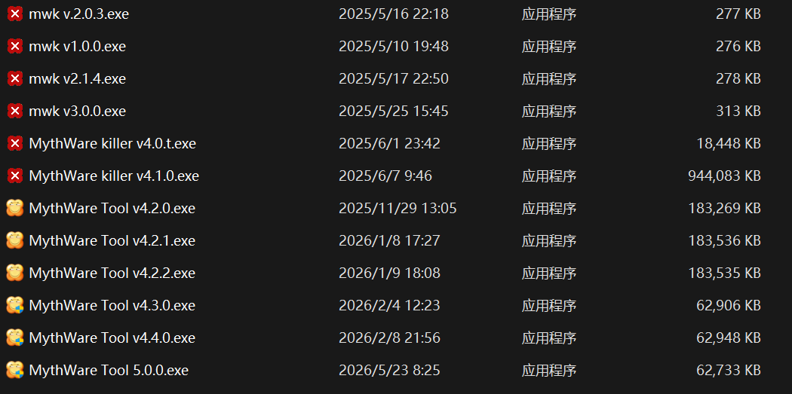

# MythWare Tool v5.0.0

用于 Windows 进程管理与极域电子教室辅助的小工具，个人学习练手项目。

## 项目介绍

本项目从 C 语言控制台版本开始，逐步迭代到 Qt 图形界面，全程为学习开发所用。

当前 v5.0.0 采用纯代码手写界面，功能已测试稳定。

## 主要功能

- 进程挂起、恢复、结束

- 重启学生端程序

- 屏幕广播解锁

- 配置文件路径管理

- 自定义消息提示框

- 多页面切换界面

## 使用说明

- 首次运行自动生成配置文件

- 可在设置中修改学生端路径

- 路径只需要填写程序所在文件夹，不需要包含文件名

## 版本迭代历程

从控制台程序到图形界面，一路学习迭代。

- v5.0.0（当前）：Qt 纯代码手写界面，功能完整稳定

- v4.x：Qt 拖拽界面开发，功能逐步扩展

- v3.0.0：EasyX 图形界面初版

- v1.x ~ v2.x：C 语言控制台练习版本

- v2.1.4重制版：[https://github.com/chenyuUwU/MythWare-Tool](https://github.com/chenyuUwU/MythWare-Tool)

## 关于 LibDeskMonitor.dll

相关文件已加密压缩，\*\*仅用于编程学习与功能演示\*\*。

解压密码：`1234`

- 仅在自己拥有合法使用权的设备上测试

- 不用于非法用途或破坏系统

- 遵守相关法律法规与校园规定

## 重要声明

本项目仅为 C++/Qt 学习练手项目，源码仅用于教学实验、技术交流。

请勿用于未经许可的控制、破解、干扰行为，一切法律责任由使用者自行承担。

